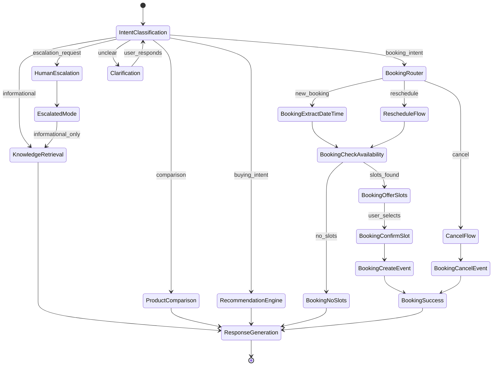
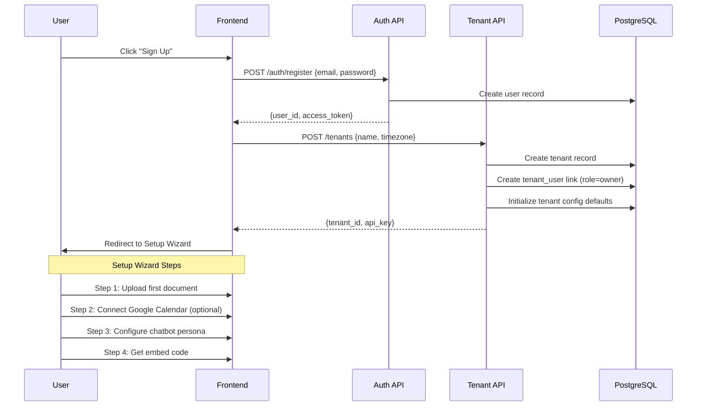
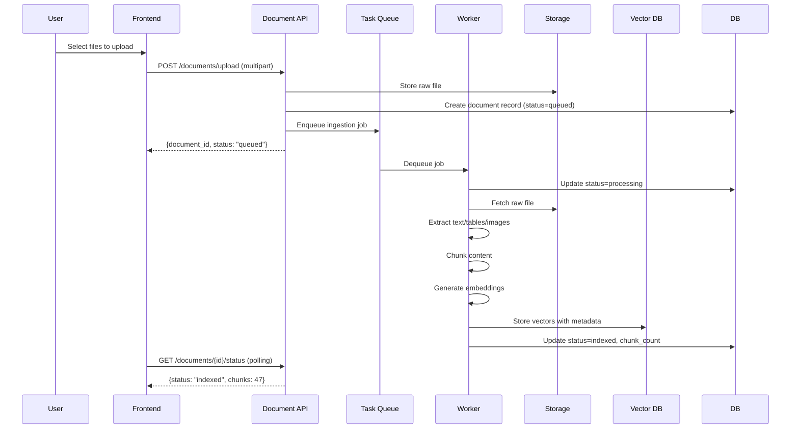
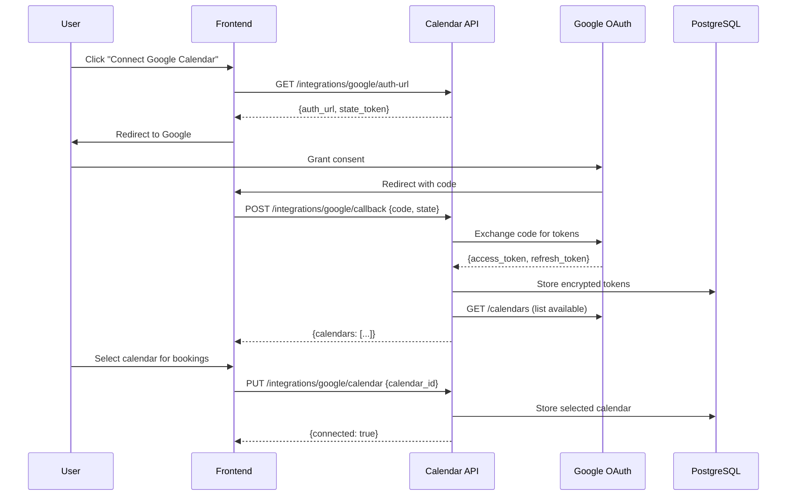
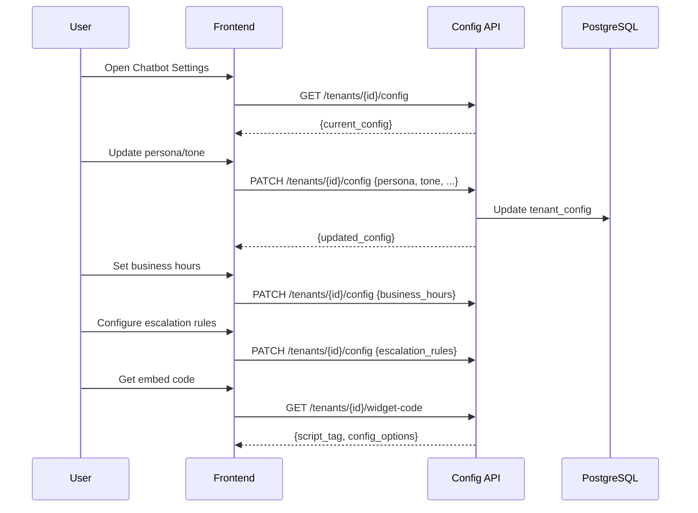

# Vectriva Workflow Design

## Finalized Architectural Decisions


| Decision   | Choice                                          | Rationale                                           |
| ---------- | ----------------------------------------------- | --------------------------------------------------- |
| Auth       | Custom JWT + OAuth2                             | Full control, no vendor lock-in, reuse Google OAuth |
| Booking    | 1:1 meetings                                    | Simpler; schema supports future multi-attendee      |
| Escalation | Continue with restricted capabilities           | Agent answers FAQs but cannot execute tools         |
| Timezone   | UTC storage + tenant default + session override | Industry standard, no DST bugs                      |


---

# Part 1: Agent Workflow (LangGraph)

## 1.1 State Machine Diagram




## 1.2 State Definitions

### IntentClassification

- **Purpose**: Classify user message into actionable intent
- **Input**: `user_message`, `conversation_history`
- **Output**: `intent: Literal["informational", "comparison", "buying_intent", "booking_intent", "escalation_request", "unclear"]`
- **LLM Call**: Yes (structured output)
- **Transitions**: Route based on `intent` value

### KnowledgeRetrieval

- **Purpose**: Execute RAG query against tenant's document store
- **Input**: `user_message`, `tenant_id`
- **Output**: `retrieved_chunks: List[Chunk]`, `retrieval_metadata`
- **Tool Call**: `retrieve_product_data`
- **Transitions**: Always to `ResponseGeneration`

### ProductComparison

- **Purpose**: Retrieve multiple products and structure comparison
- **Input**: `user_message`, `extracted_products: List[str]`
- **Output**: `comparison_table: Dict`
- **Tool Call**: `retrieve_product_data` (multiple queries)
- **Transitions**: Always to `ResponseGeneration`

### RecommendationEngine

- **Purpose**: Match user needs to products
- **Input**: `user_message`, `extracted_requirements`
- **Output**: `recommendations: List[Product]`
- **LLM Call**: Yes (reasoning over RAG results)
- **Transitions**: Always to `ResponseGeneration`

### BookingRouter

- **Purpose**: Determine booking sub-intent
- **Input**: `user_message`
- **Output**: `booking_action: Literal["new_booking", "reschedule", "cancel"]`
- **LLM Call**: Yes (structured output)
- **Transitions**: Route to appropriate booking sub-flow

### BookingExtractDateTime

- **Purpose**: Extract date/time preferences from user message
- **Input**: `user_message`, `tenant_timezone`
- **Output**: `preferred_date: date`, `preferred_time_range: Optional[TimeRange]`
- **LLM Call**: Yes (structured extraction)
- **Transitions**: Always to `BookingCheckAvailability`

### BookingCheckAvailability

- **Purpose**: Query Google Calendar for available slots
- **Input**: `preferred_date`, `tenant_id`, `calendar_id`
- **Output**: `available_slots: List[TimeSlot]`
- **Tool Call**: `check_availability`
- **Transitions**: `slots_found` if len > 0, else `no_slots`

### BookingOfferSlots

- **Purpose**: Present available slots to user
- **Input**: `available_slots`, `customer_timezone`
- **Output**: `formatted_slots: str` (human-readable)
- **LLM Call**: No (template formatting)
- **Transitions**: Wait for user selection

### BookingConfirmSlot

- **Purpose**: Confirm user's slot selection
- **Input**: `selected_slot`, `user_confirmation`
- **Output**: `confirmed_slot: TimeSlot`
- **LLM Call**: Yes (parse user selection)
- **Transitions**: Always to `BookingCreateEvent`

### BookingCreateEvent

- **Purpose**: Create calendar event with Google Meet
- **Input**: `confirmed_slot`, `tenant_id`, `customer_info`
- **Output**: `event_id`, `meet_link`
- **Tool Call**: `create_event`
- **Transitions**: Always to `BookingSuccess`

### HumanEscalation

- **Purpose**: Flag conversation and restrict capabilities
- **Input**: `escalation_reason`, `conversation_id`
- **Output**: `escalation_record`
- **Side Effect**: Insert escalation record, notify tenant
- **Transitions**: Always to `EscalatedMode`

### EscalatedMode

- **Purpose**: Continue conversation with restricted tools
- **Capabilities**: `can_retrieve_knowledge: true`, `can_execute_tools: false`
- **Transitions**: Only to `KnowledgeRetrieval` (informational queries only)

### ResponseGeneration

- **Purpose**: Generate final response to user
- **Input**: All accumulated context
- **Output**: `response: str`
- **LLM Call**: Yes
- **Transitions**: End turn

---

## 1.3 Tool Schemas

### check_availability

```python
class CheckAvailabilityInput(BaseModel):
    date: date
    duration_minutes: int = Field(default=30, ge=15, le=120)
    timezone: str = Field(description="IANA timezone, e.g. America/New_York")

class TimeSlot(BaseModel):
    start: datetime  # UTC
    end: datetime    # UTC

class CheckAvailabilityOutput(BaseModel):
    available_slots: list[TimeSlot]
    calendar_id: str
    checked_date: date
```

**Validation Rules**:

- `date` must be today or future (max 30 days ahead)
- `timezone` must be valid IANA identifier
- `duration_minutes` must align with tenant's slot configuration

**Error Types**: `CalendarNotConnected`, `InvalidTimezone`, `DateOutOfRange`

---

### create_event

```python
class CreateEventInput(BaseModel):
    start_time: datetime  # UTC
    end_time: datetime    # UTC
    customer_email: EmailStr
    customer_name: str = Field(min_length=1, max_length=100)
    summary: str = Field(default="Consultation Booking")
    description: str = Field(default="")

class CreateEventOutput(BaseModel):
    event_id: str
    meet_link: HttpUrl
    calendar_link: HttpUrl
    start_time: datetime
    end_time: datetime
```

**Validation Rules**:

- `start_time` must be in the future
- `end_time` must be after `start_time`
- Slot must still be available (re-check before creation)

**Error Types**: `SlotNoLongerAvailable`, `CalendarAPIError`, `InvalidEmail`

---

### reschedule_event

```python
class RescheduleEventInput(BaseModel):
    event_id: str
    new_start_time: datetime  # UTC
    new_end_time: datetime    # UTC

class RescheduleEventOutput(BaseModel):
    event_id: str
    old_time: TimeSlot
    new_time: TimeSlot
    meet_link: HttpUrl  # preserved
```

**Validation Rules**:

- `event_id` must exist and belong to tenant
- New slot must be available
- Event must be in the future

**Error Types**: `EventNotFound`, `SlotNoLongerAvailable`, `EventInPast`

---

### cancel_event

```python
class CancelEventInput(BaseModel):
    event_id: str
    cancellation_reason: str = Field(default="Cancelled by customer")

class CancelEventOutput(BaseModel):
    event_id: str
    cancelled_at: datetime
    was_notified: bool
```

**Validation Rules**:

- `event_id` must exist and belong to tenant
- Event must be in the future

**Error Types**: `EventNotFound`, `EventInPast`, `CalendarAPIError`

---

### retrieve_product_data

```python
class RetrieveProductDataInput(BaseModel):
    query: str = Field(min_length=1, max_length=500)
    top_k: int = Field(default=5, ge=1, le=20)
    filter_document_types: list[str] | None = None

class Chunk(BaseModel):
    content: str
    document_id: str
    document_name: str
    chunk_type: Literal["text", "table", "image_caption"]
    similarity_score: float
    metadata: dict

class RetrieveProductDataOutput(BaseModel):
    chunks: list[Chunk]
    query_embedding_id: str  # for audit
```

**Validation Rules**:

- `query` is sanitized (no prompt injection patterns)
- `filter_document_types` must be valid types if provided

**Error Types**: `EmbeddingServiceError`, `NoDocumentsIndexed`

---

### escalate_to_human

```python
class EscalateToHumanInput(BaseModel):
    reason: Literal[
        "customer_request",
        "repeated_failures",
        "low_confidence",
        "sensitive_topic",
        "negative_sentiment"
    ]
    context_summary: str = Field(max_length=500)

class EscalateToHumanOutput(BaseModel):
    escalation_id: str
    escalated_at: datetime
    notification_sent: bool
```

**Validation Rules**:

- One escalation per conversation (idempotent)

**Error Types**: `AlreadyEscalated`

---

## 1.4 Conversation Context Model

```python
@dataclass
class AgentContext:
    # Identity
    conversation_id: str
    tenant_id: str
    customer_id: str | None
    
    # Conversation State
    current_state: str
    turn_count: int
    messages: list[Message]
    
    # Intent Tracking
    last_intent: str | None
    intent_history: list[str]
    
    # Booking Context (persists across turns)
    booking_flow_active: bool = False
    preferred_date: date | None = None
    preferred_time_range: TimeRange | None = None
    selected_slot: TimeSlot | None = None
    pending_event_id: str | None = None
    
    # Escalation State
    is_escalated: bool = False
    escalation_reason: str | None = None
    
    # Error Tracking
    consecutive_errors: int = 0
    tool_call_count: int = 0
    
    # Metadata
    customer_timezone: str | None = None
    created_at: datetime
    updated_at: datetime
```

**Serialization**: JSON via Pydantic, stored in Redis with TTL (24h default).

---

## 1.5 Error Handling Strategy

### Retry Policies


| Error Type              | Retryable | Max Retries | Backoff                  |
| ----------------------- | --------- | ----------- | ------------------------ |
| `CalendarAPIError`      | Yes       | 3           | Exponential (1s, 2s, 4s) |
| `EmbeddingServiceError` | Yes       | 2           | Linear (1s)              |
| `SlotNoLongerAvailable` | No        | -           | Re-fetch availability    |
| `EventNotFound`         | No        | -           | Inform user              |
| `InvalidTimezone`       | No        | -           | Ask user to clarify      |


### Escalation Triggers

Auto-escalate when:

- `consecutive_errors >= 3`
- Sentiment analysis detects frustration
- User explicitly requests human
- Confidence score < 0.4 on intent classification
- Tool call fails after max retries

### Fallback Behavior

```
On tool failure:
  1. Log error with full context
  2. Increment consecutive_errors
  3. If retriable: retry with backoff
  4. If not retriable or max retries exceeded:
     - If consecutive_errors >= 3: trigger escalation
     - Else: apologize and offer alternative

On LLM failure:
  1. Retry once with same prompt
  2. If fails: return generic "I'm having trouble, please try again"
  3. Log for manual review
```

---

# Part 2: Tenant Admin Workflows

## 2.1 Onboarding Flow




**API Endpoints**:

- `POST /auth/register` - Create user account
- `POST /auth/login` - Get access token
- `POST /auth/refresh` - Refresh token
- `POST /tenants` - Create tenant
- `GET /tenants/{id}/setup-status` - Check wizard completion

---

## 2.2 Document Management Flow




**API Endpoints**:

- `POST /documents/upload` - Upload document
- `GET /documents` - List tenant documents
- `GET /documents/{id}` - Get document details
- `GET /documents/{id}/chunks` - View chunks
- `DELETE /documents/{id}` - Delete and remove vectors
- `POST /documents/{id}/reindex` - Re-process document

**Document States**: `queued` → `processing` → `indexed` | `failed`

---

## 2.3 Google Calendar OAuth Flow




**API Endpoints**:

- `GET /integrations/google/auth-url` - Get OAuth URL
- `POST /integrations/google/callback` - Handle OAuth callback
- `GET /integrations/google/calendars` - List available calendars
- `PUT /integrations/google/calendar` - Set booking calendar
- `DELETE /integrations/google` - Disconnect integration

**Token Storage**: Encrypted at rest using Fernet (tenant-specific key derived from master key).

---

## 2.4 Chatbot Configuration Flow




**Configuration Schema**:

```python
class TenantConfig(BaseModel):
    # Agent Persona
    persona_name: str = "Assistant"
    tone: Literal["professional", "friendly", "casual"] = "professional"
    custom_instructions: str = ""
    
    # Business Hours (for booking)
    timezone: str = "UTC"
    business_hours: list[BusinessHourBlock]
    
    # Escalation Rules
    auto_escalate_on_failure_count: int = 3
    auto_escalate_on_negative_sentiment: bool = True
    escalation_email: EmailStr | None = None
    
    # Widget Appearance
    primary_color: str = "#0066CC"
    widget_position: Literal["bottom-right", "bottom-left"] = "bottom-right"
    welcome_message: str = "Hi! How can I help you today?"
```

**API Endpoints**:

- `GET /tenants/{id}/config` - Get current config
- `PATCH /tenants/{id}/config` - Update config (partial)
- `GET /tenants/{id}/widget-code` - Get embeddable script

---

## 2.5 API Key Management

**API Endpoints**:

- `POST /tenants/{id}/api-keys` - Generate new key
- `GET /tenants/{id}/api-keys` - List keys (masked)
- `DELETE /tenants/{id}/api-keys/{key_id}` - Revoke key
- `GET /tenants/{id}/api-keys/{key_id}/usage` - Get usage stats

**Key Format**: `vect_live_` + 32 random bytes (base64)

**Storage**: Hash stored in DB; full key shown once on creation.

---

## 2.6 Observability Flow

**API Endpoints**:

- `GET /conversations` - List conversations (paginated)
- `GET /conversations/{id}` - Get full conversation with messages
- `GET /conversations/{id}/tool-calls` - Get tool execution log
- `GET /conversations/{id}/retrievals` - Get RAG retrieval log
- `GET /analytics/summary` - Aggregated metrics

**Logged Data Per Conversation**:

- All messages (user + agent)
- Intent classifications
- Tool calls with inputs/outputs/latency
- RAG retrievals with chunks and scores
- Escalation events
- Token usage

---

# Implementation Order

1. **Agent Core** (LangGraph state machine, context model)
2. **Tool Implementations** (calendar, RAG, escalation)
3. **Auth System** (JWT, OAuth)
4. **Tenant Management** (CRUD, config)
5. **Document Pipeline** (upload, ingestion, embedding)
6. **Admin API** (all endpoints above)
7. **Widget Backend** (chat WebSocket/SSE)
8. **Frontend** (Next.js admin dashboard)

